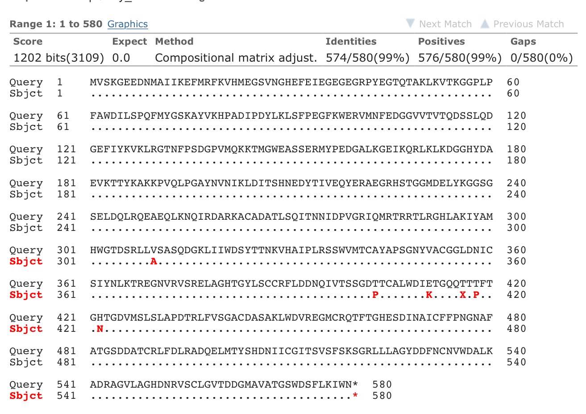

<!--rmarkdown v1 -->

## Wyniki sekwencjonowania.
- kolonia 1

<div style="width:400px; height:200px">

</div>

## Uporządkowanie danych dla donora: *alfa-s-mCitrine*

Odrzucenie danych o skrajnie odstających czasach życia. Uzupelnienie brakujących wartosci przy dopasowaniach monoeksponencjalnych. Brakujące wartosci zastapiono 21 wartosciami wygenerowanymi pseudolosowo, z rozkladu normalnego o sredniej 1.75 i odchyleniu standardowym 0.25. Uzyskane wartosci:

```{r, echo=FALSE, cache = TRUE}
donor <- readRDS("./data/alfa_S_mCitrine_donor_filtered.rds")
rnum <- donor$lft_1[is.na(donor[,2])]
print(rnum)
summary(rnum)
```

##Podsumowanie danych dla donora:
```{r, echo=FALSE}
summary(donor)
```

####Odchylenie standardowe czasów życia: `r round(sd(donor$tau_amp), 3)`

***
##Porównanie wyników (z akceptorem: beta-3-mCherry)

####Dane dla pomiarów z beta-3-mCherry i gamma2:
```{r, echo=FALSE, cache=TRUE}
akceptor <- readRDS("./data/alfa-s_mCitrine_gamma2_beta3-mCherry.rds")
summary(akceptor)
```
***

##Jeszcze trochę czyszczenia
####Przed porównaniem srednich czasów życia fluorescencji donora bez i z akceptorem usunięto wyniki mieszczące się poza 99% poziomem ufnosci. 
####Dla samego donora:

```{r, echo=FALSE, cache=TRUE}
outoutliers <- function (df, x=6, p=.95){

    if(!("outliers" %in% installed.packages())) {install.packages("outliers")}
        else require(outliers)
    if(!("dplyr" %in% installed.packages())) {install.packages("dplyr")}
    else require(dplyr)

outliers <- scores(df[,x], type="z", prob=p)

newdf <- dplyr::filter(df, !outliers)

message(cat("The outliers for", p*100 ,"% confidence interval are:\n", 
            df[outliers, x], "\n",
            rep("-", 20)), "\n", 
            "The mean and median with outliers are respectively: ", 
            round(mean(df[,x]), 2), " ; ", median(df[,x]), "\n",
            "The mean and median without outliers are respectively: ", 
            round(mean(newdf[,x]), 2), " ; " ,median(newdf[,x]))
return(newdf)
}

donorout <- outoutliers(donor, x=6, p=.99)
```

####Dla donora i akceptora:
```{r, echo=FALSE, cache=TRUE}
akceptorout <- outoutliers(akceptor, x=5, p=.99)
```

