##Wyniki sekwencjonowania
###Kolonia 1:

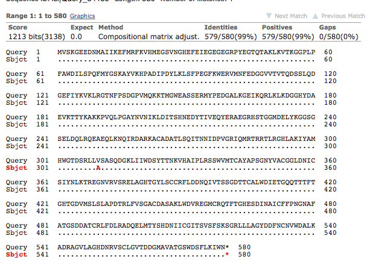
***

###Kolonia 2:

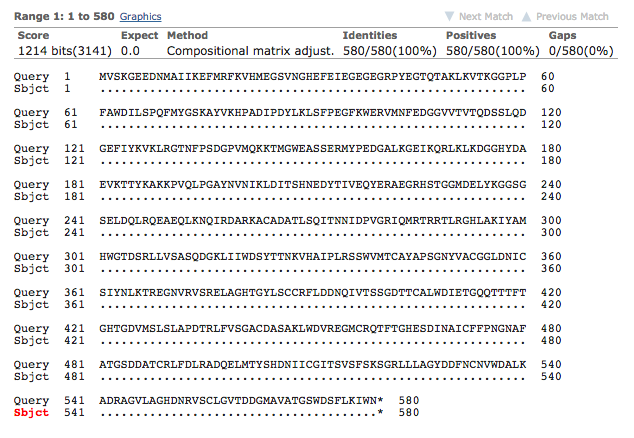


***

###Kolonia 3:

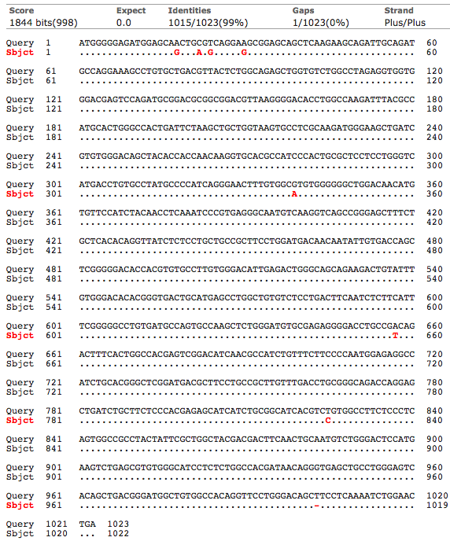


###Uporz¹dkowanie danych dla donora: *alfa-s-mCitrine*

####Odrzucenie danych o skrajnie odstaj¹cych czasach ¿ycia. Uzupelnienie brakuj¹cych wartosci przy dopasowaniach monoeksponencjalnych. Brakuj¹ce wartosci zastapiono 21 wartosciami wygenerowanymi pseudolosowo, z rozkladu normalnego o sredniej 1.75 i odchyleniu standardowym 0.25. Uzyskane wartosci:

```{r, echo=FALSE, cache = TRUE}
donor <- readRDS("./data/alfa_S_mCitrine_donor_filtered.rds")
rnum <- donor$lft_1[is.na(donor[,2])]
print(rnum)
summary(rnum)
```

####Podsumowanie danych dla donora:
```{r, echo=FALSE}
summary(donor)
```

####Odchylenie standardowe czasów ¿ycia: `r round(sd(donor$tau_amp), 3)`

***

###Porównanie wyników (z akceptorem: beta-3-mCherry)

####Dane dla pomiarów z beta-3-mCherry i gamma2:
```{r, echo=FALSE, cache=TRUE}
akceptor <- readRDS("./data/alfa-s_mCitrine_gamma2_beta3-mCherry.rds")
summary(akceptor)
```
***
####Przed porównaniem srednich czasów ¿ycia fluorescencji donora bez i z akceptorem usuni¹to wyniki mieszcz¹ce siê poza 99% poziomem ufnosci. 
####Dla samego donora:

```{r, echo=FALSE, cache=TRUE}
outoutliers <- function (df, x=6, p=.95){

    if(!("outliers" %in% installed.packages())) {install.packages("outliers")}
        else require(outliers)
    if(!("dplyr" %in% installed.packages())) {install.packages("dplyr")}
    else require(dplyr)

outliers <- scores(df[,x], type="z", prob=p)

newdf <- dplyr::filter(df, !outliers)

message(cat("The outliers for", p*100 ,"% confidence interval are:\n", 
            df[outliers, x], "\n",
            rep("-", 20)), "\n", 
            "The mean and median with outliers are respectively: ", 
            round(mean(df[,x]), 2), " ; ", median(df[,x]), "\n",
            "The mean and median without outliers are respectively: ", 
            round(mean(newdf[,x]), 2), " ; " ,median(newdf[,x]))
return(newdf)
}

donorout <- outoutliers(donor, x=6, p=.99)
```

####Dla donora i akceptora:
```{r, echo=FALSE, cache=TRUE}
akceptorout <- outoutliers(akceptor, x=5, p=.99)
```

####Test na statystycznie istotn¹ ró¿nic¹ miêdzy srednimi czasami ¿ycia:
```{r, echo=FALSE, cache=TRUE}
compare <- function(donor, FLIM){
    
    data <- data.frame(amp_1 = c(mean(donor$amp_1, na.rm = T), mean(FLIM$amp_1)), 
                       lft_1 = c(mean(donor$lft_1, na.rm = T), mean(FLIM$lft_1)), 
                       amp_2 = c(mean(donor$amp_2, na.rm = T), mean(FLIM$amp_2)), 
                       lft_2 = c(mean(donor$lft_2, na.rm = T), mean(FLIM$lft_2)),
                       tau_amp = c(mean(donor$tau_amp), mean(FLIM$tau_amp)),
                       row.names = c(substitute(donor), substitute(FLIM)))
    print((t.test(donor$tau_amp, FLIM$tau_amp)))
    return(data)
}

compare(donorout, akceptorout)
```

###Transfer energii: `r round((1 - (mean(akceptorout$tau_amp)/mean(donorout$tau_amp)))*100, 2)`%

##Co z tym transferem?
###alfa-s z mCitrine, beta-3 z mCherry:
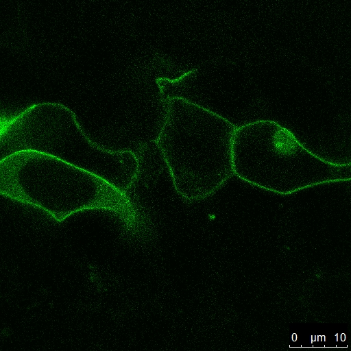
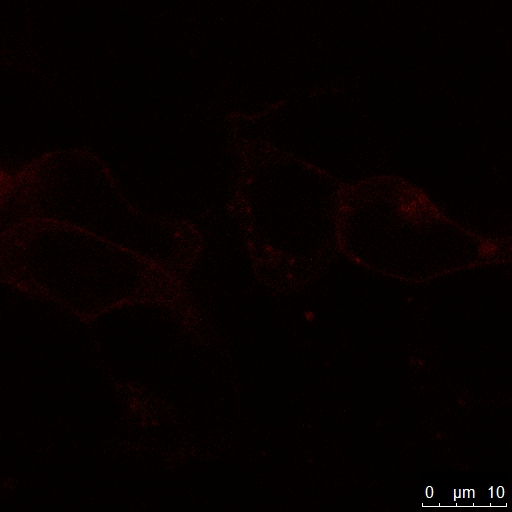

## i solidarnie
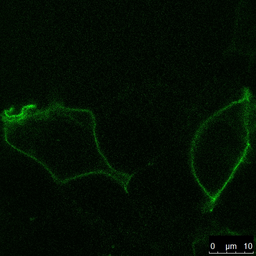
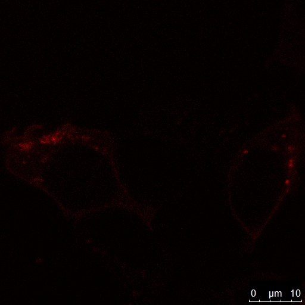

## i wci¹¿
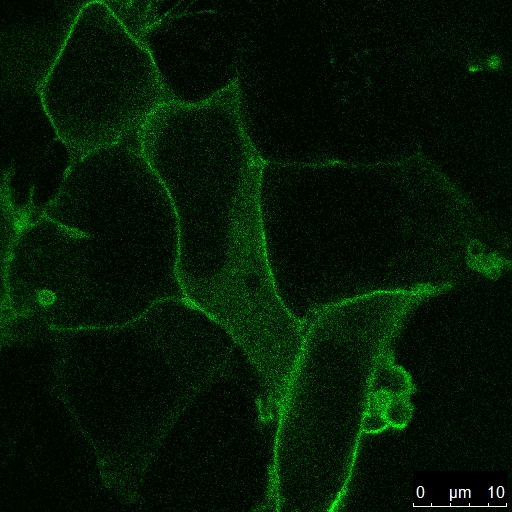
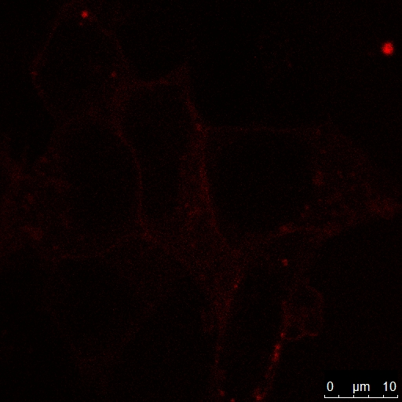

## nie swiecilo nale¿ycie
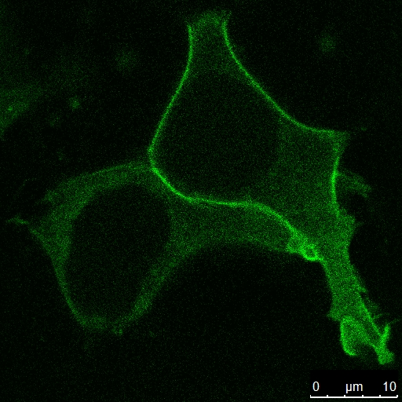
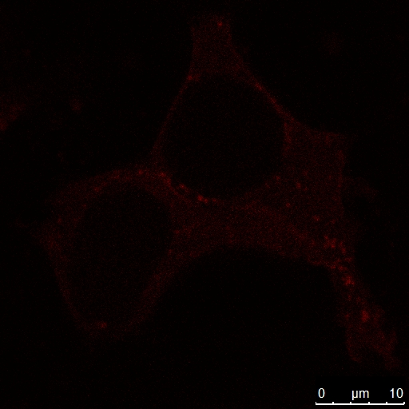

##Z kolei beta-1 niosla nadziejê
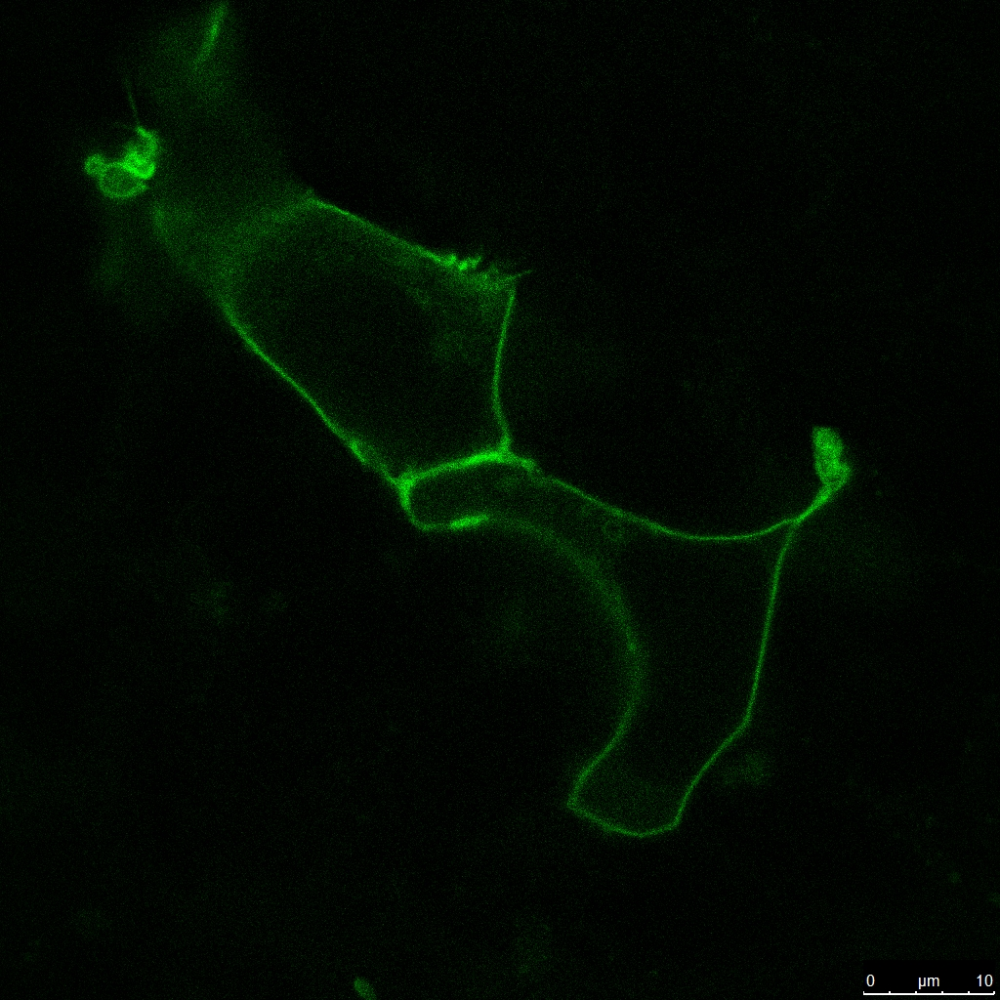
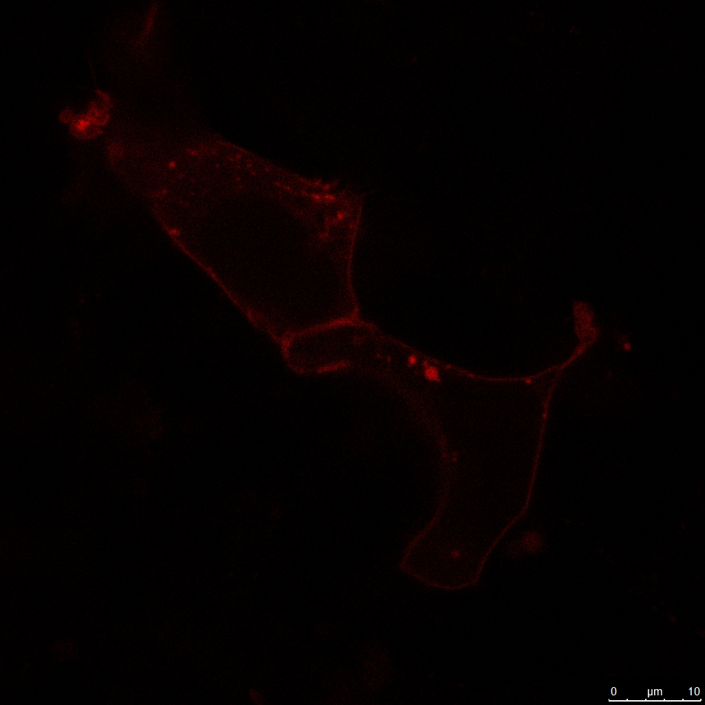

##i niosla
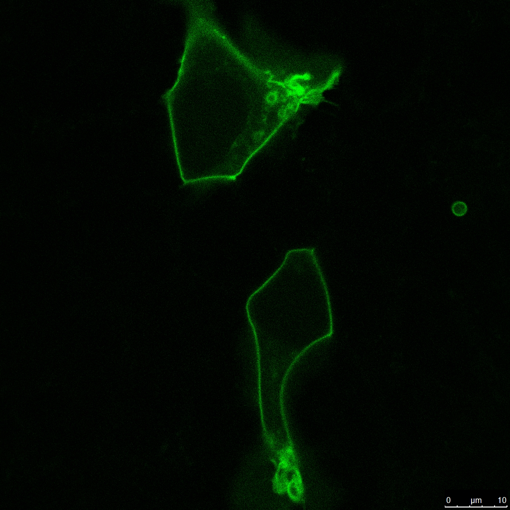
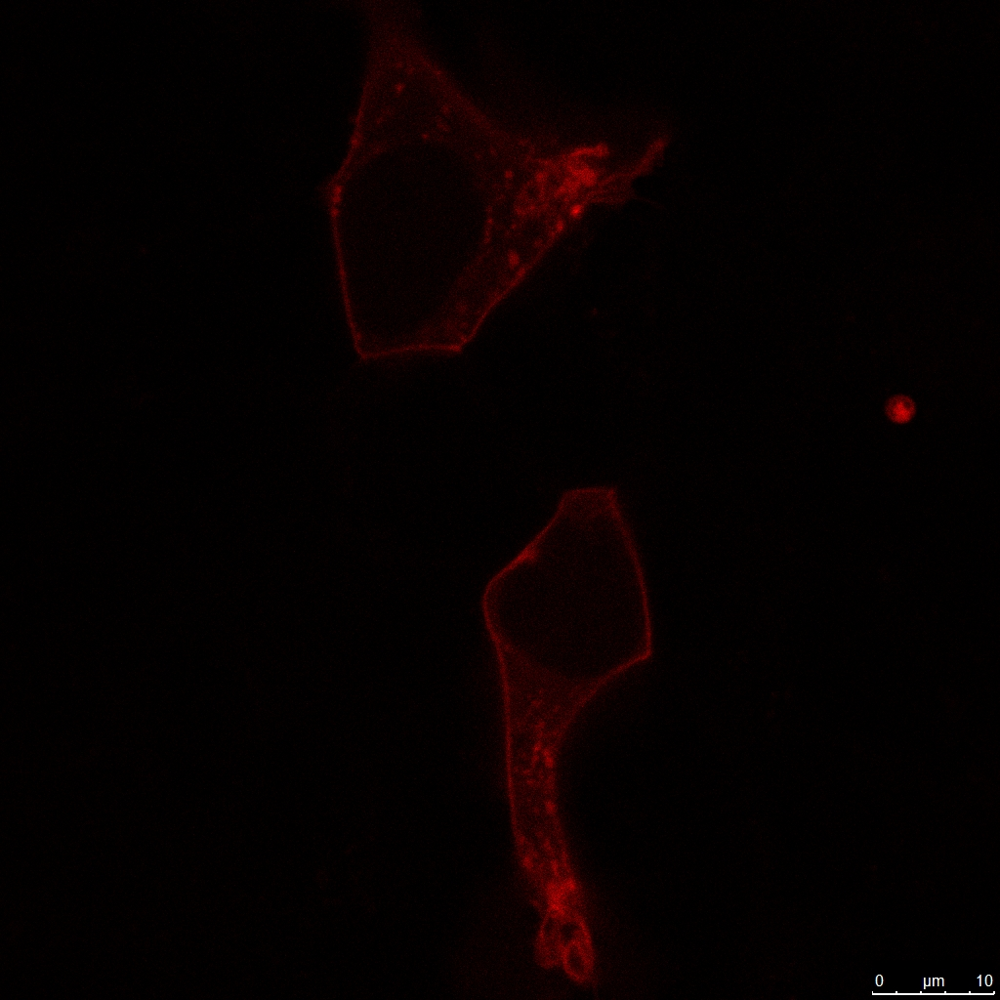

##ku pokrzepieniu
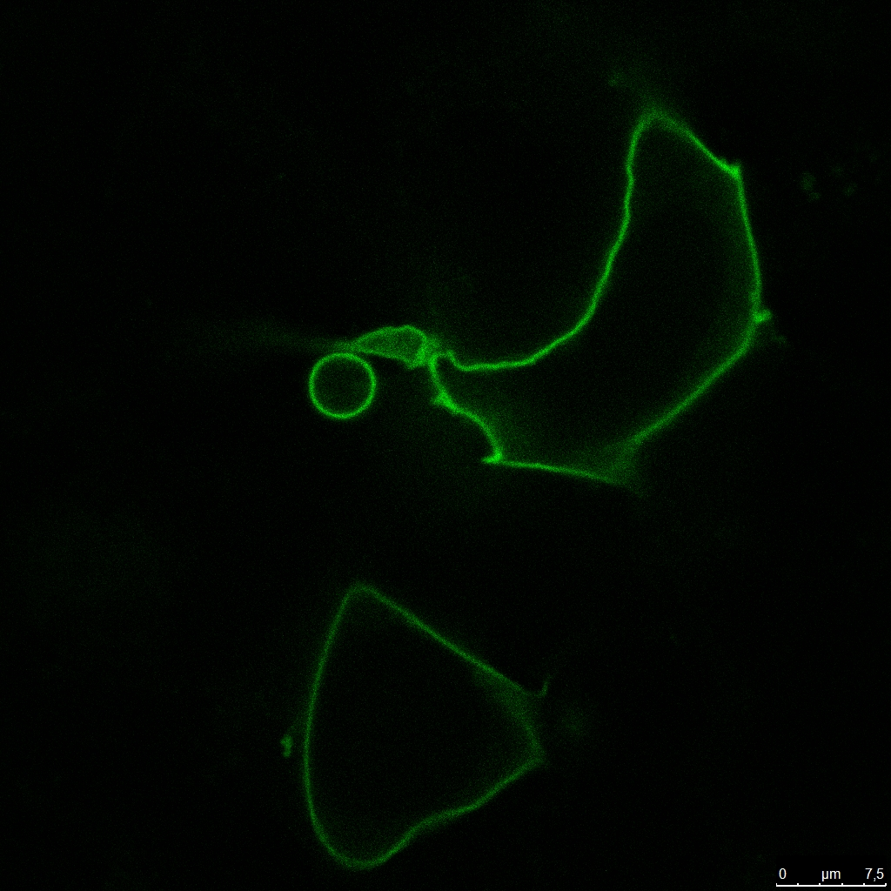
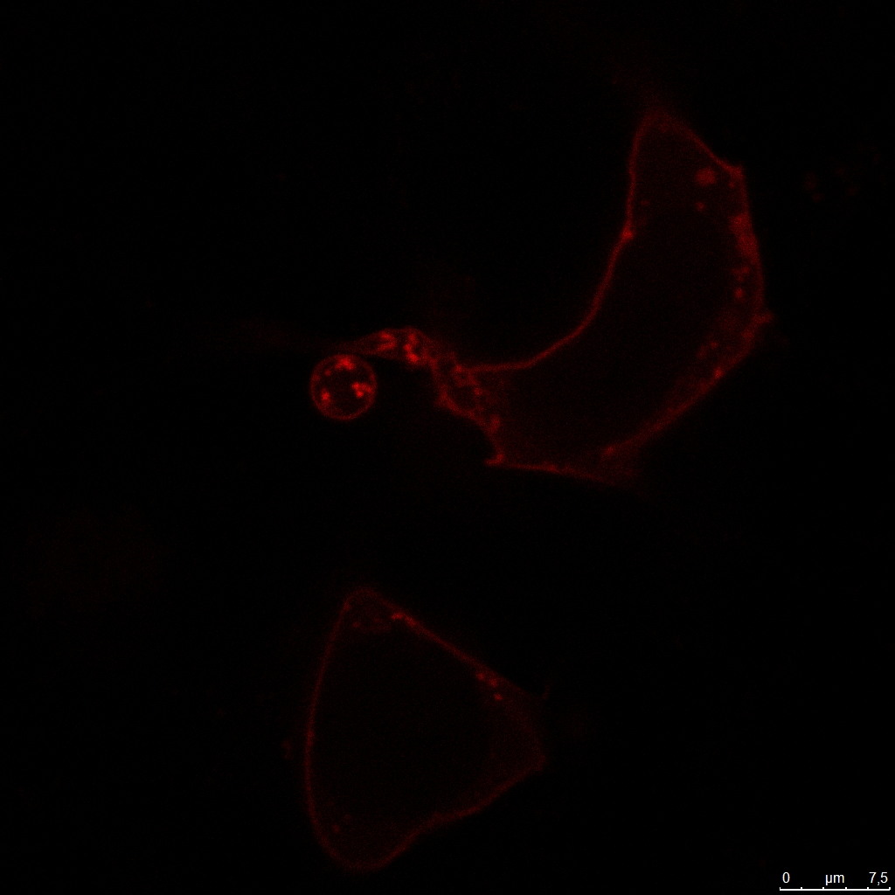

##Porównanie wyników (z akceptorem: beta-1-mCherry)

####Dane dla pomiarów z beta-1-mCherry i gamma2:
```{r, echo=FALSE, cache=TRUE}
akceptorbeta1 <- readRDS("./data/alfa-s_mCitrine_gamma2_beta1-mCherry.rds")
summary(akceptorbeta1)
```

##Usuniêcie danych odstaj¹cych:
```{r, echo=FALSE, cache=TRUE}
akceptorbeta1out <- outoutliers(akceptorbeta1, x=5, p=.99)
```

##Test t Welcha na statystycznie istotn¹ ró¿nic¹ miêdzy srednimi czasami ¿ycia:
```{r, echo=FALSE, cache=TRUE}
compare(donorout, akceptorbeta1out)
```

###Transfer energii: `r round((1 - (mean(akceptorbeta1out$tau_amp)/mean(donorout$tau_amp)))*100, 2)`%

###Ale patrz¹c na poszczególne czasy ¿ycia, nalezy sie zastanowiæ nad modyfikacj¹ dopasowania.