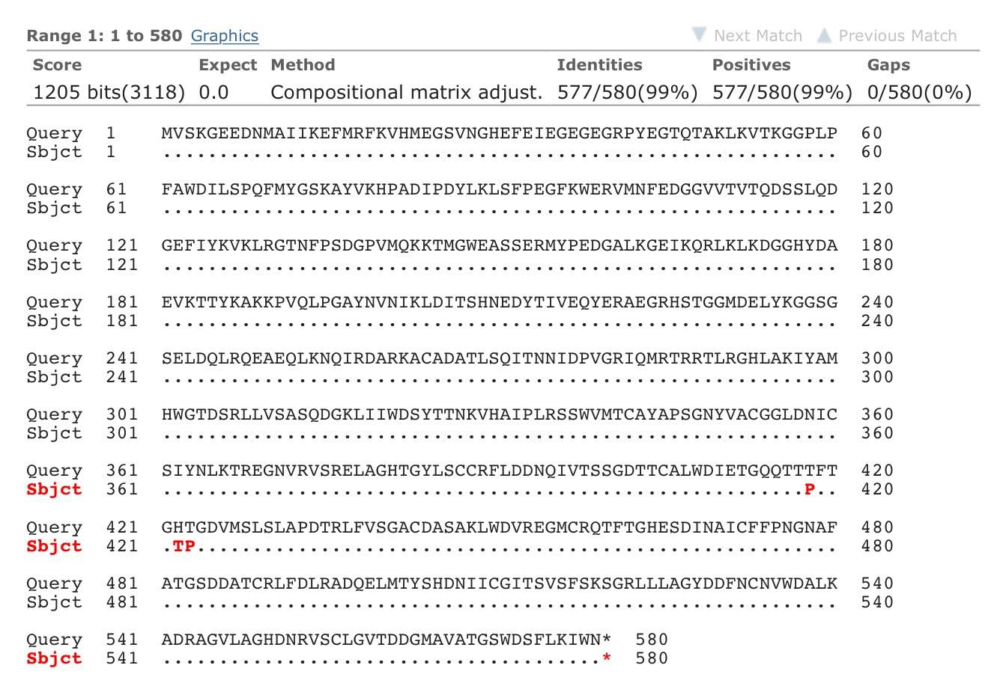
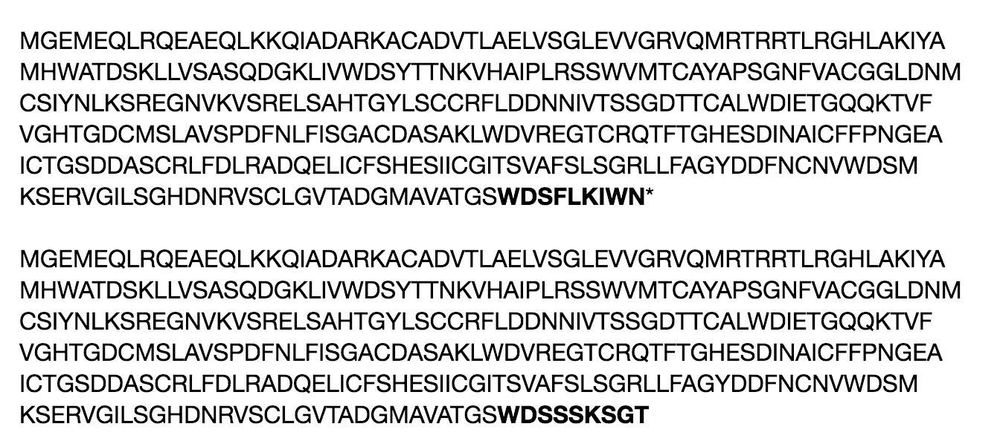

<!--rmarkdown v1 -->


##Wyniki sekwencjonowania
###Kolonia 1:
<div style="width:700px; height:450px">

</div>

***

###Kolonia 2:
<div style="width:700px; height:450px">

</div>

***

###Kolonia 3:
<div style="width:700px; height:450px">

</div>

###Uporządkowanie danych dla donora: *alfa-s-mCitrine*

####Odrzucenie danych o skrajnie odstających czasach życia (1<lft_1<3, 2<lft_2<4). Uzupelnienie brakujących wartosci przy dopasowaniach monoeksponencjalnych. Brakujące wartosci zastapiono 21 wartosciami wygenerowanymi pseudolosowo, z rozkladu normalnego o sredniej 1.75 i odchyleniu standardowym 0.25. Uzyskane wartosci:


```
##  [1] 2.174721 1.551352 1.837109 1.183650 1.709449 2.032716 1.636114
##  [8] 1.525208 1.931710 1.547640 1.816771 1.315684 1.397144 1.636612
## [15] 1.491127 2.090536 1.979364 1.553714 1.893380 1.979549 1.814072
```

```
##    Min. 1st Qu.  Median    Mean 3rd Qu.    Max. 
##   1.184   1.548   1.709   1.719   1.932   2.175
```

####Podsumowanie danych dla donora:

```
##                      samples       amp_1             lft_1      
##  alfa_S_mCitrine_donor_10: 1   Min.   :  462.5   Min.   :1.074  
##  alfa_S_mCitrine_donor_11: 1   1st Qu.: 1907.1   1st Qu.:1.702  
##  alfa_S_mCitrine_donor_12: 1   Median : 5369.3   Median :1.979  
##  alfa_S_mCitrine_donor_13: 1   Mean   : 9979.8   Mean   :2.048  
##  alfa_S_mCitrine_donor_14: 1   3rd Qu.:11088.0   3rd Qu.:2.450  
##  alfa_S_mCitrine_donor_15: 1   Max.   :80546.3   Max.   :2.975  
##  (Other)                 :66   NA's   :21                       
##      amp_2            lft_2          tau_amp     
##  Min.   :  2270   Min.   :3.000   Min.   :2.530  
##  1st Qu.:  8874   1st Qu.:3.075   1st Qu.:3.020  
##  Median : 17663   Median :3.204   Median :3.040  
##  Mean   : 53430   Mean   :3.252   Mean   :3.029  
##  3rd Qu.: 49566   3rd Qu.:3.324   3rd Qu.:3.060  
##  Max.   :450838   Max.   :3.884   Max.   :3.090  
## 
```

####Odchylenie standardowe czasów życia: 0.07

***

###Porównanie wyników (z akceptorem: beta-3-mCherry)

####Dane dla pomiarów z beta-3-mCherry i gamma2:

```
##      amp_1           lft_1           amp_2             lft_2      
##  Min.   : 1438   Min.   :1.364   Min.   :  373.8   Min.   :1.268  
##  1st Qu.: 3597   1st Qu.:2.087   1st Qu.: 7308.0   1st Qu.:2.633  
##  Median : 7052   Median :2.709   Median :11174.8   Median :3.167  
##  Mean   : 9393   Mean   :2.758   Mean   :11327.7   Mean   :2.927  
##  3rd Qu.:14768   3rd Qu.:3.279   3rd Qu.:13765.8   3rd Qu.:3.283  
##  Max.   :22275   Max.   :4.724   Max.   :29005.3   Max.   :5.791  
##     tau_amp     
##  Min.   :2.870  
##  1st Qu.:2.960  
##  Median :2.980  
##  Mean   :2.973  
##  3rd Qu.:2.990  
##  Max.   :3.030
```
***
####Przed porównaniem srednich czasów życia fluorescencji donora bez i z akceptorem usuniąto wyniki mieszczące się poza 99% poziomem ufnosci. 
####Dla samego donora:


```
## The outliers for 99 % confidence interval are:
##  2.53 2.84 
##  - - - - - - - - - - - - - - - - - - - -
```

```
## 
## The mean and median with outliers are respectively: 3.03 ; 3.04
## The mean and median without outliers are respectively: 3.04 ; 3.04
```

####Dla donora i akceptora:

```
## The outliers for 99 % confidence interval are:
##  2.87 2.87 
##  - - - - - - - - - - - - - - - - - - - -
```

```
## 
## The mean and median with outliers are respectively: 2.97 ; 2.98
## The mean and median without outliers are respectively: 2.98 ; 2.98
```

####Test na statystycznie istotną różnicą między srednimi czasami życia:

```
## 
## 	Welch Two Sample t-test
## 
## data:  donor$tau_amp and FLIM$tau_amp
## t = 10.18, df = 68.862, p-value = 2.278e-15
## alternative hypothesis: true difference in means is not equal to 0
## 95 percent confidence interval:
##  0.04801158 0.07141699
## sample estimates:
## mean of x mean of y 
##  3.038857  2.9791